# Architecture Documentation

This document provides a comprehensive overview of the anthropic-oauth library architecture, including system design, data flow, and component interactions.

> **Platform notice**: Tested and confirmed working on **macOS** with **OpenCode v1.2.27**.

## Table of Contents

1. [System Architecture](#system-architecture)
2. [OAuth Flow](#oauth-flow)
3. [Token Lifecycle](#token-lifecycle)
4. [Request Pipeline](#request-pipeline)
5. [Error Handling](#error-handling)
6. [OpenCode Integration](#opencode-integration)

---

## System Architecture

### High-Level Component Diagram

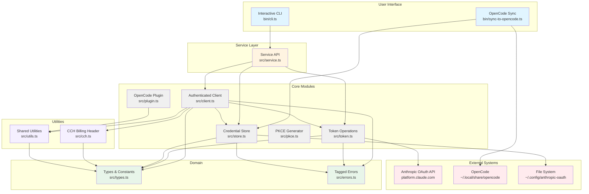

### Module Responsibilities

| Module                | Responsibility                          | Dependencies                      |
| --------------------- | --------------------------------------- | --------------------------------- |
| `cli.ts`              | Interactive user interface              | service, Effect                   |
| `sync-to-opencode.ts` | Sync credentials to OpenCode            | store, Effect                     |
| `service.ts`          | High-level API facade                   | client, token, store              |
| `client.ts`           | Authenticated HTTP requests             | token, store, cch, utils, types, errors |
| `token.ts`            | OAuth token operations                  | types, errors                     |
| `store.ts`            | Credential persistence                  | types, errors, Bun.file           |
| `pkce.ts`             | PKCE challenge generation               | @openauthjs/openauth              |
| `plugin.ts`           | OpenCode server plugin & fetch patcher  | utils, types                      |
| `cch.ts`              | Content Consistency Hashing (billing header) | types                        |
| `utils.ts`            | Header merging, URL rewriting, stream stripping | types                     |
| `types.ts`            | Domain types & constants                | -                                 |
| `errors.ts`           | Tagged error definitions                | Effect.Data                       |

---

## OAuth Flow

### Complete OAuth Authentication Flow

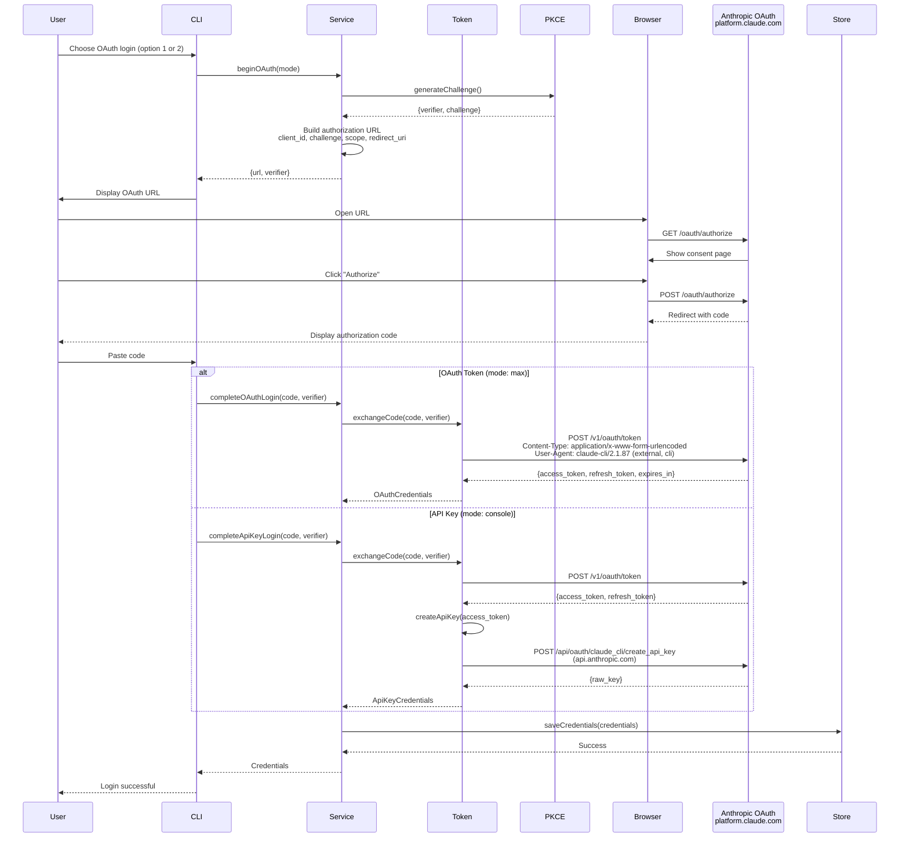

### OAuth Authorization URL Structure

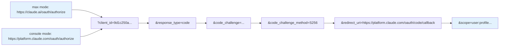

---

## Token Lifecycle

### Token States and Transitions

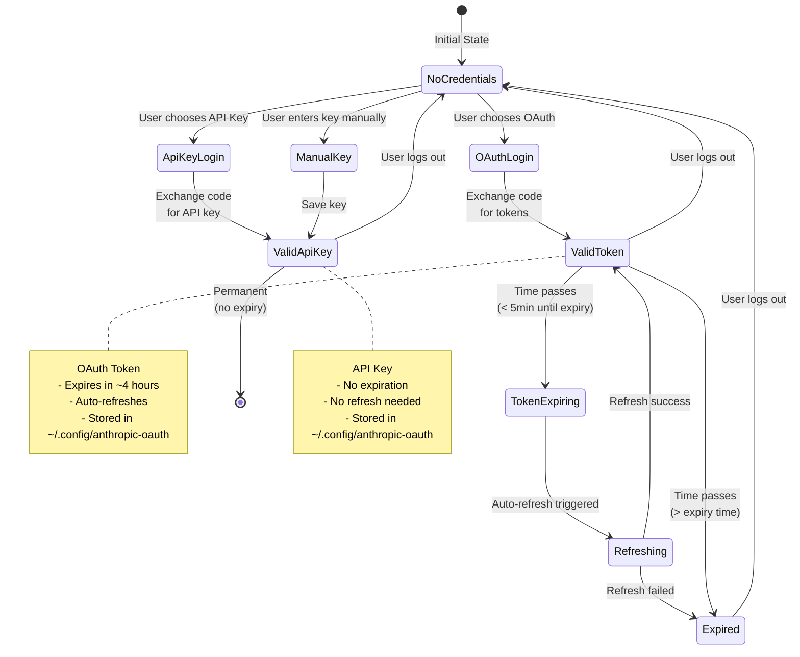

### Token Refresh Flow

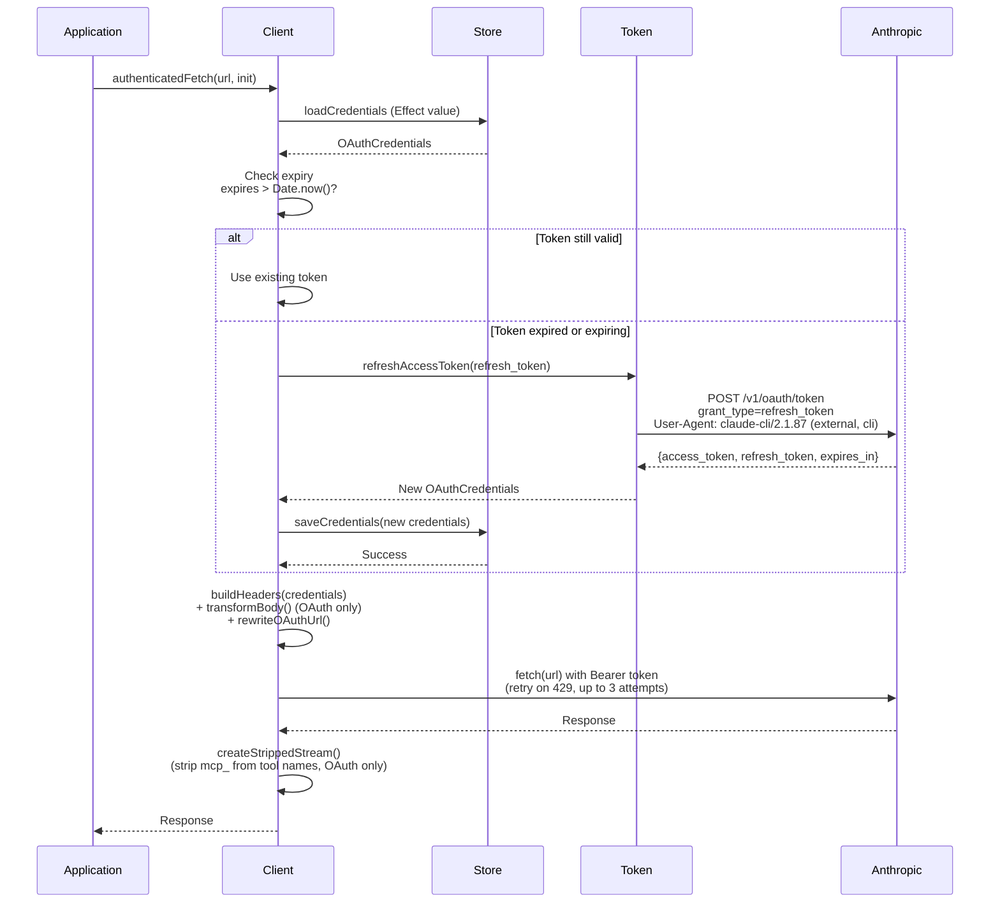

---

## Request Pipeline

### Authenticated Request Flow

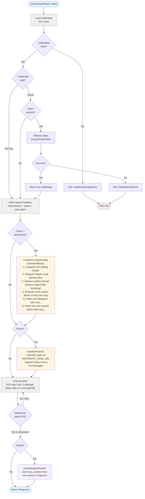

### Request Header Construction

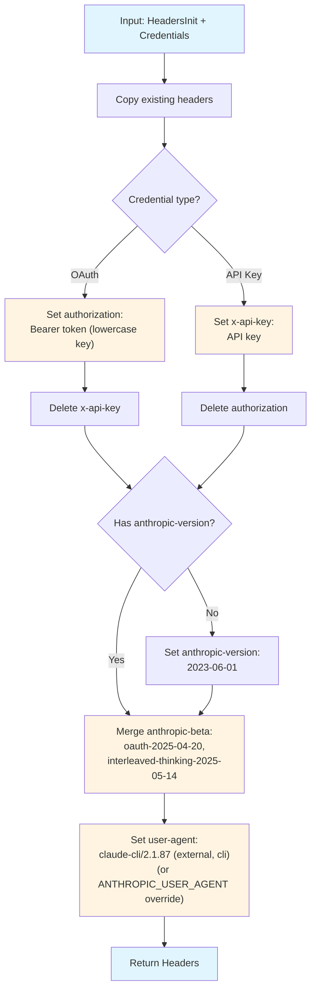

---

## Error Handling

### Error Hierarchy

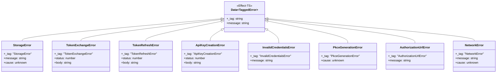

### Error Handling Flow

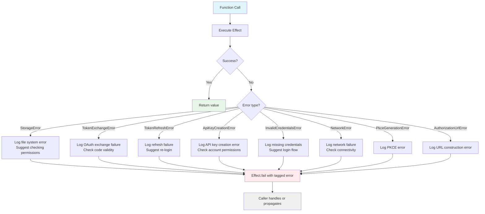

---

## OpenCode Integration

### Credential Synchronization Flow

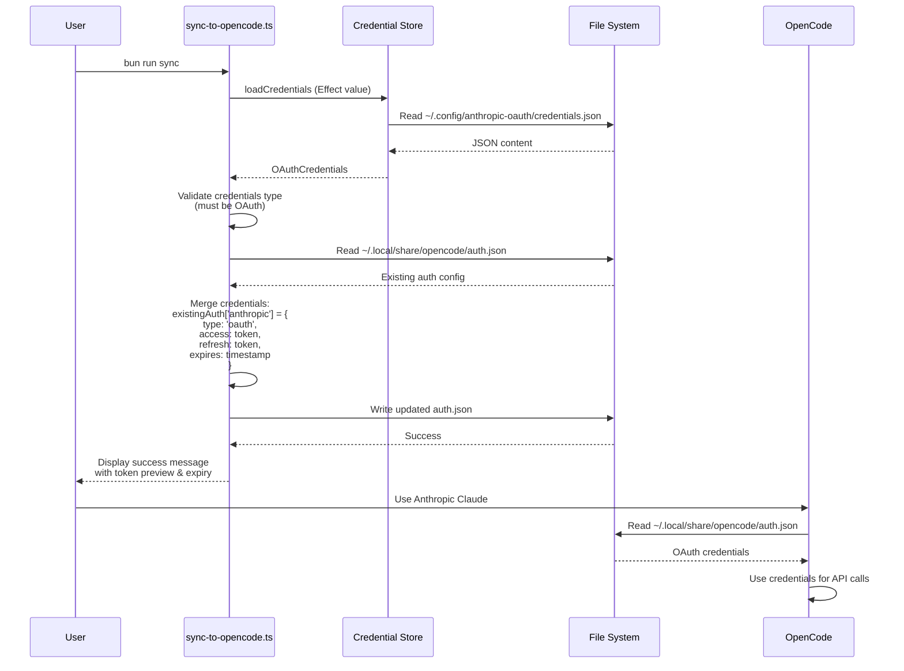

### Storage Locations

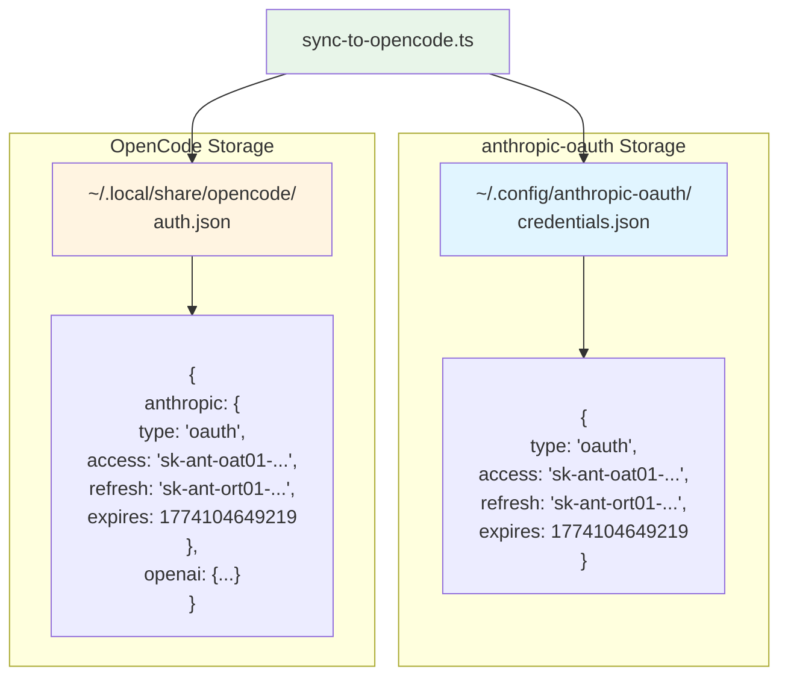

---

## Technology Stack

### Runtime & Language

```mermaid
graph LR
    subgraph "Runtime"
        Bun["Bun >=1.3.12"]
    end
    
    subgraph "Language"
        TS[TypeScript 6.0.2<br/>ESNext, Strict Mode]
    end
    
    subgraph "Core Libraries"
        Effect[Effect-TS 3.21.0<br/>Functional error handling]
    end
    
    subgraph "OAuth"
        OpenAuth[@openauthjs/openauth 0.4.3<br/>PKCE generation]
    end
    
    subgraph "External APIs"
        Anthropic["Anthropic OAuth API<br/>platform.claude.com (OAuth/token)<br/>api.anthropic.com (API key creation)"]
    end
    
    TS --> Bun
    Effect --> TS
    OpenAuth --> Effect
    Bun --> Anthropic
    
    style Bun fill:#e1f5ff
    style TS fill:#e1f5ff
    style Effect fill:#fff4e1
    style OpenAuth fill:#fff4e1
    style Anthropic fill:#ffebee
```

---

## Design Principles

### 1. Effect-Based Error Handling

All async operations return `Effect<Success, Error, Requirements>` for type-safe error propagation.

### 2. Tagged Errors

Errors extend `Data.TaggedError` for exhaustive pattern matching and clear error boundaries.

### 3. Bun-First Runtime

Uses Bun APIs exclusively (no Node.js dependencies) for maximum performance.

### 4. Immutable Data

All domain types are readonly, preventing accidental mutations.

### 5. Zero-Cost Abstractions

Effect-TS compiles to efficient JavaScript with minimal runtime overhead.

### 6. Single Responsibility

Each module has one clear purpose, making the codebase easy to navigate and maintain.

---

## Performance Considerations

### Credential Caching

- Credentials loaded once and cached in-memory (`credentialCache` in `store.ts`)
- Cache invalidated on write or clear
- File I/O only on first load, login, and logout

### Token Refresh Strategy

- Reactive refresh: triggered when token is expired at request time
- Single refresh per expiry window via `refreshInFlight` Promise mutex
- Prevents concurrent requests from each triggering a separate refresh

### Effect Optimization

- Lazy evaluation of Effect chains
- Automatic resource cleanup
- Minimal allocations for error cases

---

## Security Considerations

### Credential Storage

- OAuth tokens: `~/.config/anthropic-oauth/credentials.json`
- File permissions: `0600` (owner read/write only)
- Atomic write via temp file + rename (eliminates TOCTOU window)
- Never logged or exposed in error messages

### Token Exposure Prevention

- Display max 16 characters of tokens in UI
- Truncate tokens in logs: `sk-ant-oat01-...`
- Clear credentials on logout

### Request Security

- HTTPS-only communication
- PKCE flow for OAuth (prevents interception attacks)
- User-agent validation (prevents impersonation)

---

## Environment Variables

| Variable                        | Module        | Purpose                                                      |
| ------------------------------- | ------------- | ------------------------------------------------------------ |
| `ANTHROPIC_USER_AGENT`          | types.ts      | Override the default `claude-cli/2.1.87 (external, cli)` UA |
| `ANTHROPIC_CLIENT_ID`           | types.ts      | Override the default OAuth client ID                         |
| `ANTHROPIC_BASE_URL`            | types.ts      | Redirect all API requests to a proxy/alternative endpoint    |
| `ANTHROPIC_DEFAULT_MODEL`       | opencode.ts   | Override the default model (`claude-sonnet-4-20250514`)      |
| `OPENCODE_ANTHROPIC_USER_AGENT` | plugin.ts     | Override the Safari UA used by `AnthropicUserAgentPlugin`    |
| `EXPERIMENTAL_KEEP_SYSTEM_PROMPT` | types.ts    | Set `1`/`true` to skip relocating system blocks to user msg  |

---

## Future Enhancements

### Planned Features

1. **OpenCode Watch Mode**
   - Monitor credential changes
   - Auto-sync to OpenCode on update

2. **Multi-Account Support**
   - Store multiple OAuth profiles
   - Switch between accounts easily

3. **Automatic Token Refresh Scheduling**
   - Background process to refresh tokens 5 minutes before expiry
   - Prevents interactive re-authentication

---

## References

- [Effect-TS Documentation](https://effect.website)
- [Bun Documentation](https://bun.sh/docs)
- [OAuth 2.0 RFC 6749](https://datatracker.ietf.org/doc/html/rfc6749)
- [PKCE RFC 7636](https://datatracker.ietf.org/doc/html/rfc7636)
- [Anthropic API Documentation](https://docs.anthropic.com)
